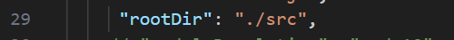
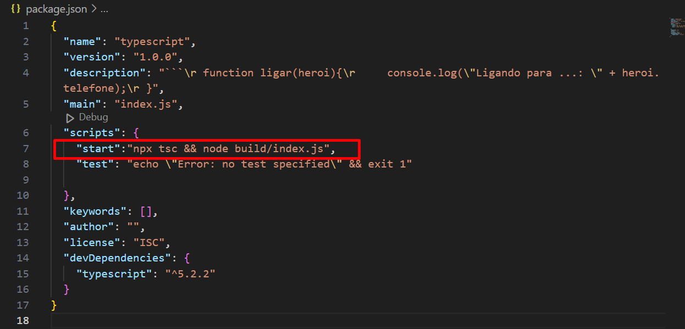
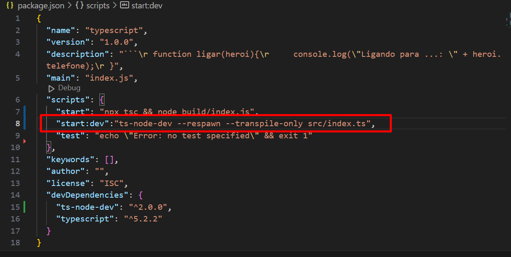

# TypeScript é um superconjunto de JavaScript, ou seja, um conjunto de ferramentas e formas mais eficientes de escrever código JavaScript, ...

# Configurando o TypeScript com Node.js

## Abra o terminal dentro da pasta e digite os comandos abaixo:
### Palavras Chave 
- DEV           -->   Desenvolvedor/Programador
- TypeScript    -->   TS
- JavaScrip     -->   JS
- Node.js       -->   npm 
- Transpilação  -->   Conversão de códigos .ts em .js
- tsconfig.json -->   Arquivo de configuração do TS
- VsCode        -->   Editior de texto inteligênte que ajuda o DEV
- Terminal      -->   Dentro do VsCode na aba Views ou Ctrl + ' 

Abrindo o terminal do VsCode precisamos fazer as seguintes configurações:

```
npm init -y                   // Inicia um projeto node.js
npm install -D typescript     // Instala dependências do TS
npx tsc --init                // Cria arquivo de configuração do TS
mkdir src                     // Cria a pasta onde ficarão os códigos 


```

# Configurações do arquivo tsconfig.json principais


-    
- Desmarcamos os comentários desta linha e alteramos para ./src 

-  
- Faremos o mesmo, em OutDir, mas apontamos para a pata ./build 


# Aprofundando em TS

- Comparando JS com TS

# Case com JS
```
function ligar(heroi){
    console.log("Ligando para ...: " + heroi.telefone);
}

ligar({
    nome:"Steve Jobs",
    vulgo:"Milionário",
    telefone:"11 33333333"
})

// Se remover-mos o atributo telefone [ telefone:"11 33333333"] o js compila normalmente sem demonstrar erros isso em um sistema de grande porte causaria problemas...
```

# Case com TS

```
type Hero = {
    nome:string,
    vulgo:string,
    telefone:number
}

function ligarPara(heroi:Hero):string{
    
    return "Ligando para ....:" + heroi.telefone
}

ligarPara({
    nome:"Jose",
    vulgo:"Capitão América",
    telefone:11333333
});

```

# Porque eu deveria utilizar typescript para capturar erros em tempo de execução diferente do js

Para executar TS é simples: node [caminho do arquivo]

```
node index.ts

```

# Para alterar a maneira de chamar o programa adicionando um comando mais simpes alteramos o arquivo package.json



"start":"npx tsc && node build/index.j"

Para rodar o programa segue com o comando:

npm run start --> isso faz a tradução e execução


Com isso podemos startar nosso arquivo com o comando abaixo:

```
node index.ts

```

Agora com tudo configurado as pastas outDir e rootDir se executarmos 


```
npm run start 

```

Tudo configurado? Então vamos por a mão na massa..

# Tipos

### Primitivos: boolean, number, string 
### Como declarar

console.log("Bem Vindo ao Artigo!")

# Declaração de variáveis 

let ligado: boolean = false //--> pode ser tipado
# ou 
let ligado1 = false //--> vai funcionar por inferência, mas isso pode causar problemas pois a variável está sujeita a receber outros valores 

let nome: string = "Jose";
let idade: number = 30
let altura: number = 1.9;


# Tipos especiais

let nulo: null = null //só pode receber um nulo não permite outro valor vai ser nulo e .
let indefinido: undefined = undefined; //Ajuda a manter a estratégia específica de variáveis

# Tipos Abrangentes
//-any  (qualquer coisa)
//-void (vazio) sem retorno retorno vazio.

let retornoView: any = "qualquer valor string ou numero etc..."//qualquer coisa valor não previsivel

# Objetos em TS

//não pode receber qualquer coisa e sim objetos entre {}

# Objetos sem previsibilidade

## Declarando um objeto sem shape

let produto: object = {
    name: "Jose",
    cidade: "Assis",
    idade: 40,
}

#Objetos com previsibilidade
## Objeto Shapado ou com forma específicada

//Struct perde a previsibilidade
type ProdutoLoja = {
    nome: string;
    preco: number;
    unidades: number;
}


// Definindo meu produto do tipo ProdutoLoja
let meuProduto = {
    nome: "Tênis",
    preco: 89.9,
    unidades: 5,
}

//shapando meu produto colocamos um retorno do type ProdutoLoja objeto tipado com previsibilidade

let meuProduto1: ProdutoLoja = {
    nome: "Arroz",
    preco: 15.0,
    unidades: 100,
}

# Arrays ou vetores 

# Maneiras de declarar ********************************

let dados: string[] = ["JOSE", "ALINE", "JOAQUIM"]

// OU

let dados1: Array<string> = ["JOSE", "ALINE", "JOAQUIM"]

# ******************************************************

# Arrays Multi types [ | ] o pipe significa ou

let infos: (string | number)[] = ["Jose", 1, 2, "Aline"] //tomar cuidado com esses tipos de vetores talvez seria melhor criar objetos shapados para não cair em armadilhas

// Tuplas: São vetores multi types porém tem um lugar certo para cada coisa (exta ordem como foi definido)

let boleto: [string, number, number] = ["Conta de água", 199.9, 33333]

/*

* arrays métodos --> todos os métodos do JS comum.
dados.push(), .pop(), .filter() etc...

*/

let aniversario: Date = new Date("2022-12-01 05:00")
console.log(aniversario.toString())

# Funções em TS são as mesmas do js normal
## O que diferênia é que podem ser tipados os valores de entrada e de retorno

function addNumber(x: number, y: number): number {
    return x + y
}

let soma = addNumber(4, 7)

console.log("Soma é " + soma)
//explícita quando passo retorno implicita quando não passo o tipo de retorno
function addToHello(name: string): string {
    return `Hello ${name}`
}

console.log(addToHello("José Américo"))

# Funções Multi Types --> suponhamos que você quer pegar dados do BD e você espera uma string, porém por alguma eventualidade ele retorna um null ou número etc..

# Precisamos preparar as funções para essas eventualidades

//especícicando o tipo de retorno, mais por sintaxe
// ou any --> porém perde o sentido de utilizar typescript
function callToPhone(phone: number | string): number | string {
    return phone
}


// A função callToPhone retorn um ou outro
console.log(callToPhone(12345678))
console.log(callToPhone("12345"))


# Funções Async --> assincronas

//implicitamente ele entende que o retorno é Promise, porém podemos passar o retorno Promise<tipo de valor especificado> tornando mais explícot, quanto mais explícito o código melhor...

async function getDatabase(id: number): Promise<string> {
    return "José"
}


# Interfaces (Type x Funções)

type robot = {
    id: number, // ou id:number | string; a segunda opção a propriedade torna-se multitype
    //readonly: id:number | string; --> tornaria a propriedade somente leitura
    name: string,
}


//type --> utilizado para tipar um conjunto ou objeto
const bot: robot = {
    id: 1,
    name: "megamen"
}


//inteface --> utilizado para tipar classes interface --> contrato e quem herda tem que seguir esse contrato.
interface robot2 {
    id: number | string;
    name: string;
    sayHello(): string;


}

//herdando do type
const bot2: robot = {
    id: 0,
    name: "megamen"
}

//herdando da inteface
const bot3: robot2 = {
    id: 0,
    name: "megamen",
    sayHello(): string {
        return "Hello!"
    }
}


console.log(bot)
console.log(bot2)
console.log(bot3) //console.log(bot3.nome) --> não estaria acessível

# Quando utilizar interfaces (se comportam da mesma maneira, porém com algumas peculiaridades)

class Pessoa implements robot2 {
    id: string | number;
    name: string;
    constructor(id: string | number, name: string) {
        this.id = id;
        this.name = name;

    }
    sayHello(): string {
        return `Hello ${this.name}`
    }
}

# Como utilizar a classe Pessoa

const pessoa = new Pessoa(1, "joseameircojunior");
console.log(pessoa.sayHello())


# Aprofundando types e interfaces são bem parecidos, recomenda-se trabalhar com type para tipar variáveis e interfaces para tipar objetos.

# Quando inteface e type são transpilados -> no arquivo convertido .js são identicos, porém .ts tem mais significado para o desenvolvedor porquê permite diferenciar na hora de desnvolver o código.

# Classes são formas que são criadas para ser o molde de nossos objetos.


class Personagem {
    name?: string; // name?: string; [?] significa opcional
    forca: number;
    skill: number;
    constructor(name: string, forca: number, skill: number) {
        // this.name = name;
        this.forca = forca;
        this.skill = skill;

    }

    attack(): void {
        console.log(`Attack with ${this.forca} points`);
    }

}

const p1 = new Personagem("ciclop", 20, 4000);
p1.attack() //já retorna um console.log pois é do tipo void

// Trabalhando com Modifiers -> modificadores de acesso

//public    -->
//private   --> a propriedade só pode ser acessada dentro da classe somente pelo construtor
//protected --> 

//ex: 

class Carro {
    id: number;
    private nome: string;
    cor: string;

    constructor(id: number, nome: string, cor: string) {
        this.id = id;
        this.nome = nome;
        this.cor = cor;
    }

    acelerar(): void {
        console.log(`Carro ${this.cor} ${this.nome} está acelerando!`)
    }
}

const carro = new Carro(122, "Fusca", "vermelho")
carro.acelerar();
//carro.name --> na classe Carro não estaria disponível, pois colocamos private dentro da class
// Já o protected permite faz o mesmo, porém quem extender/herdar poderá enxergar esses atributos.

// Os data modifiers também pode ser aplicados em métodos da mesma forma

class Frutas {
    nome: string


    constructor(nome: string) {
        this.nome = nome;
        this.imprime(nome);
    }

    private getNome(): void {
        console.log(`Fruta ${nome}`)
    }

    imprime(nome: string): void {
        console.log(nome)
    }

}

const furta = new Frutas("Banana");
// furta.getNome() --> não funciona poerque foi declarado private


# O que influência nas classe public ou private segue a mesma lógica ex: private | protected | readonly | ? opcional | as regras de modificadores de acesso servem para atributos ou métodos 
## Isso infuência na hora de instânciar os objetos.. não acessível ou acessível dentro ou fora da classe

# Subclasses


# Magico é uma subclasse de Personagem
# Personagem super classe Magico subclasse

class Magico extends Personagem {

    magicPoints: number;

    constructor(name: string, poder: number, skill: number, magicPoints: number) {
        super(name, poder, skill);
        this.magicPoints = magicPoints;
    }

}

const p2 = new Magico("Mago", 9, 30, 300);
p2.skill = 2;

# Generics --> fui comprar um remédio específico (eu já tenho em mente o que eu gostaria de levar), porém o farmaceutico não tem esse, mas tem um genérico.

#  Temos uma função que temos dois arrays e preciso juntar em um só
# ... aceito vários arrays
function concatArray(...itens: any[]): any[] {

    // os [...] são spreads para concatenar
    return new Array().concat(...itens);

}
const numArray = concatArray([1, 5, [3]])
const stgArray = concatArray(["felipe", "goku"], ["viega"])


console.log(numArray)
console.log(stgArray)

# tudo funcionando só que quebramos uma régra permite adicionar string no array de numeros    numArray.push("saitama") 

// caso eu queira especificar qual tipo de parametro eu quero que seja retornado.

//Resolução para a função que retorna any -> específicar o tipo que eu quero 

//generics (em aberto o que vai ser passado) utilizamos o <T> dinâmico para especificar o retorno 
function concatArray1<T>(...itens: any[]): any[] {

    // os ... são spreads para concatenar
    return new Array().concat(...itens);

}
//<number[]> como o <T> foi específicado na função especificar na hora de chamar a função.
const numArray1 = concatArray1<number[]>([1, 6], [7]);
const strArray1 = concatArray1<string[]>(["jose"], ["maria"])

console.log(numArray1)
console.log(strArray1)


let startDev = "Teste npm run start:dev"
console.log(startDev)

console.log("Agora quando salvo ele executa sem transpilar")

//Decorators na vida real são: --> fui na padaria do zé você vê o leite. Ai você lembrou que sua mãe falou que quando visse o leite a menos de 3,00 você compra porque é vantagem. De tanto sua mãe falar você comprou. Você decorou então você executa alguma ação.

// Decorators na programação @nomeMetodo


function ExibirNome(target: any) {
    return console.log(target)
}

@ExibirNome
class Funcionario {

}

@ExibirNome
class Quincas {

}

//Suponhamos que temos várias classes que são apis e queremos documentar 

function apiVerison(version: string) {
    return (target: any) => {
        Object.assign(target.prototype, { __version: version, __name: "José" })
    }
}


# O metodo sobescreve obedecendo o comportamento de teste < ou >  podemos implementar vários comportamentos nos decorators.

function mainLenght(lenght: number) {
    return (target: any, key: string) => {
     
        let _value = target[key];
        
        const getter = () => "[play] " + _value;
        const setter = (value: string) => {
            if(value.length<lenght){
                throw new Error(`Tamanho menor do que ${lenght}`)
            }else {
                _value = value;
            }
        };
        Object.defineProperty(target, key, {
            get: getter,
            set: setter,
        });

        
    }
};


class Api {
    @mainLenght(10)
    name: string;

    constructor(name: string) {
        this.name = name;
    }

}

const api = new Api("pxxxxxxxxxxxx");
console.log(api.name);


# Atribute Decorator colocado sobre propriedade


# Vide o código:

[index.ts](index.ts)

## Métodos de Arrays

/*

* arrays métodos --> todos os métodos do JS comum.
dados.push(), .pop(), .filter() etc...

*/

# Trabalhando com TS no DEV

Configuração para desenvolvimento

Existe outra maneira de codar sem gera builds toda hora adicionamos uma facilidade isto é:
Instalando um servidor local para gerar os builds locais sem 
```
npm install ts-node-dev -D 

```

E no arquivo package.json:




# Após configuração 

para fazer o start:

```
npm run start:dev 

```

# Isso cria um servidor local de typescript para facilitar as compilações na hora de desnvolver.


# Principio dos Decorators
Isso ainda é experimental no ts
Habilitar no tsconfig.ts


## Testando a criação de decorators para validar e implementar coportamentos que sobescrevem 

```

function ExibirNome(target: any) {
    return console.log(target)
}

@ExibirNome
class Funcionario {

}

@ExibirNome
class Quincas {

}

//Suponhamos que temos várias classes que são apis e queremos documentar 

function apiVerison(version: string) {
    return (target: any) => {
        Object.assign(target.prototype, { __version: version, __name: "José" })
    }
}


//O metodo sobescreve obedecendo o comportamento de teste < ou >  podemos implementar vários comportamentos nos decorators.
function mainLenght(lenght: number) {
    return (target: any, key: string) => {
     
        let _value = target[key];
        
        const getter = () => "[play] " + _value;
        const setter = (value: string) => {
            if(value.length<lenght){
                throw new Error(`Tamanho menor do que ${lenght}`)
            }else {
                _value = value;
            }
        };
        Object.defineProperty(target, key, {
            get: getter,
            set: setter,
        });

        
    }
};


class Api {
    @mainLenght(10)
    name: string;

    constructor(name: string) {
        this.name = name;
    }

}

const api = new Api("pxxxxxxxxxxxx");
console.log(api.name);


// Atribute Decorator colocado sobre propriedade
```
