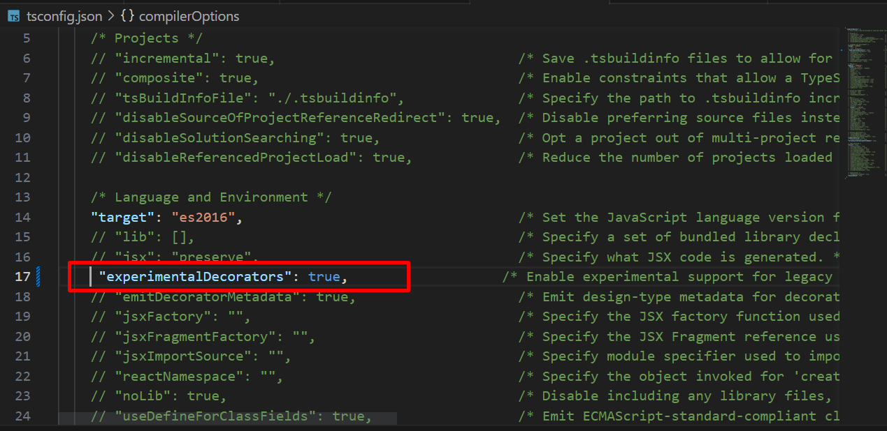
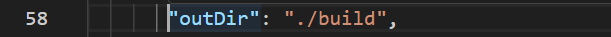
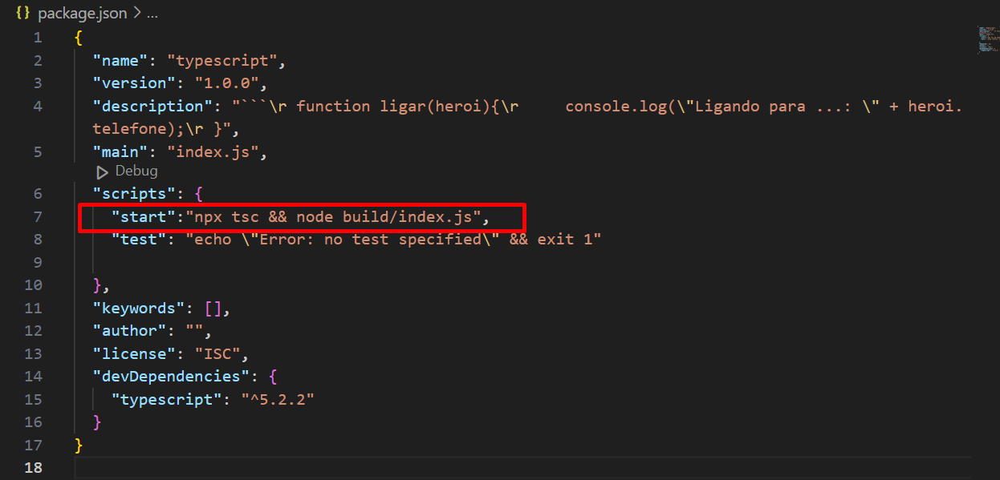

# Configurando o TypeScript com Node.js

## Abra o terminal dentro da pasta e digite os comandos abaixo:
### Palavras Chave 
- DEV           -->   Desenvolvedor/Programador
- TypeScript    -->   TS
- JavaScrip     -->   JS
- Node.js       -->   npm 
- Transpilação  -->   Conversão de códigos .ts em .js
- tsconfig.json -->   Arquivo de configuração do TS
- VsCode        -->   Editior de texto inteligênte que ajuda o DEV
- Terminal      -->   Dentro do VsCode na aba Views ou Ctrl + ' 

Abrindo o terminal do VsCode precisamos fazer as seguintes configurações:

```
npm init -y                   // Inicia um projeto node.js
npm install -D typescript     // Instala dependências do TS
npx tsc --init                // Cria arquivo de configuração do TS
mkdir src                     // Cria a pasta onde ficarão os códigos 


```

# Configurações do arquivo tsconfig.json principais


   - Desmarcamos os comentários desta linha e alteramos para ./src 
- Faremos o mesmo, em OutDir, mas apontamos para a pata ./build 

# Aprofundando em TS

- Comparando JS com TS

# Case com JS
```
function ligar(heroi){
    console.log("Ligando para ...: " + heroi.telefone);
}

ligar({
    nome:"Steve Jobs",
    vulgo:"Milionário",
    telefone:"11 33333333"
})

// Se remover-mos o atributo telefone [ telefone:"11 33333333"] o js compila normalmente sem demonstrar erros isso em um sistema de grande porte causaria problemas...
```

# Case com TS

```
type Hero = {
    nome:string,
    vulgo:string,
    telefone:number
}

function ligarPara(heroi:Hero):string{
    
    return "Ligando para ....:" + heroi.telefone
}

ligarPara({
    nome:"Jose",
    vulgo:"Capitão América",
    telefone:11333333
});

```

# Porque eu deveria utilizar typescript para capturar erros em tempo de execução diferente do js

Para executar TS é simples: node [caminho do arquivo]

```
node index.ts

```

# Para alterar a maneira de chamar o programa adicionando um comando mais simpes alteramos o arquivo package.json



"start":"npx tsc && node build/index.j"

Para rodar o programa segue com o comando:

npm run start --> isso faz a tradução e execução


Com isso podemos startar nosso arquivo com o comando abaixo:

```
node index.ts

```

Agora com tudo configurado as pastas outDir e rootDir se executarmos 


```
npm run start 

```

Tudo configurado? Então vamos por a mão na massa..

# Tipos

### Primitivos: boolean, number, string 
### Como declarar

let ligado:boolean = false --> pode ser tipado
ou 
let ligado = false --> vai funcionar por inferência, mas isso pode causar problemas

let nome: string ="Jose";
let idade:number =30 
let altura:number = 1.9;

